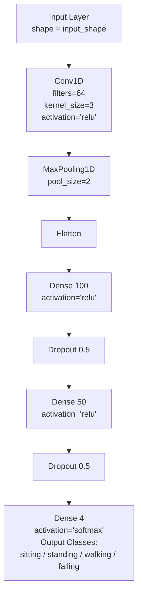

# TinyFall-Edge-Detection: Real-Time Fall Detection on Edge Hardware

**TinyFall** is an ultra-lightweight 1D Convolutional Neural Network (CNN) designed for geriatric fall detection using Inertial Measurement Unit (IMU) data. Optimized specifically for constrained embedded systems, this model achieves **96.9% accuracy** while fitting entirely within **50kB of memory** and enabling real-time classification with an inference time of just **0.04 milliseconds**.

## The Engineering Challenge
The primary goal was to implement a highly accurate fall detection system while adhering to the severe computational constraints of low-power microcontrollers. This necessitated deep architectural optimization and aggressive post-training quantization to maintain high performance with minimal footprint.

## Project Demonstration
**Video Demo**
[Watch the video](https://youtube.com/shorts/6d8xSa9DpKQ?si=zA1o80VmW4YFAAO0)

## Technical Implementation & Optimization

This project demonstrates a full end-to-end TinyML pipeline: from data preprocessing to model deployment on the edge.

## Dataset
* Accelerometer and Gyroscope data
* 6 total Features
* * Gyroscope X, Y, Z
  * Accelerometer X, Y, Z

### System Design
* **Input Data:** 6 features collected from the IMU
* **Design Rationale:** Used a CNN, because they excel at recoginizing patterns from
complex datasets, and are able to make quick accurate classifications.

## Optimization
* Implemented a sliding window aporach, because predictions on one datapoint were not accurate.
* Created a sliding window which allowed the CNN to access more data when making a prediction. Decided on a sliding window of 15, because it balanced accuracy and inference time.
* Applied a 50% dropout layer to prevent overfitting

## Model Architecure

## System Architecture

```mermaid
flowchart TD

    A[SenseHat Sensors<br/>• Gyroscope (x,y,z)<br/>• Accelerometer (x,y,z)] 
        --> B[Sliding Window Buffer<br/>window_size = 15]

    B --> C[Preprocessing<br/>Reshape to (1, window_size, 6)]

    C --> D[TFLite Interpreter<br/>Check_Point.tflite]

    D --> E[Model Output<br/>Softmax Probabilities<br/>[sitting, standing, walking, falling]]

    E --> F[Post-processing<br/>argmax(prediction)]

    F --> G[SenseHat LED Matrix<br/>Color Feedback<br/>Blue/Yellow/Green/Red]

    %% Loop back to data acquisition
    G -. continuous loop .-> A
```

### Edge Deployment & Quantization
* **Target Hardware:** **Raspberry Pi 4**.
* **Quantization:** The trained model was converted to **TFLite format** and optimized using **post training quantization to int8 format**. This reduced the size by **75%** with a minimal $\sim 0.1\%$ drop in accuracy.
* **Inference Loop:** Implements a memory-efficient **sliding window algorithm** to process incoming sensor data continuously, ensuring minimal latency and responsiveness.

## Performance Metrics

| Metric | Value | Detail |
| :--- | :--- | :--- |
| **Accuracy (Pre-Quantization)** | 97.0% | Based on validation set. |
| **Accuracy (Quantized)** | **96.9%** | **Final deployed performance.** |
| **Model Footprint** | **50 kB** | Size of the `.tflite` file. |
| **Inference Latency** | **0.04 ms** | Time required for one prediction cycle. |
| **Deployment Platform** | **Raspberry Pi** | Confirms true embedded functionality. |

* Confusion Matrix


## Future Work
* Experiment with different model types such as LSTM
* Use Knowledge distillation to reduce size and increase speed
* Deploy model on smaller hardware
* Used filters to reduce noise on the signal


